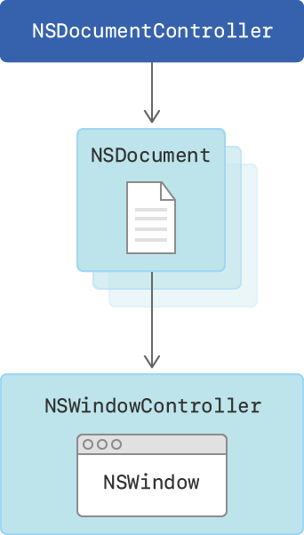
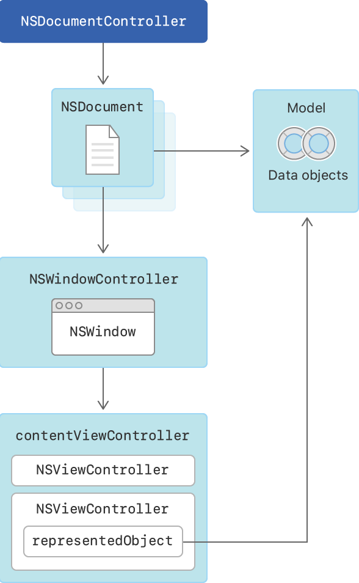

# Developing a Document-Based App

Write an app that creates, manages, edits, and saves text documents.

## Overview

This sample shows how to use the Cocoa document architecture to manage documents. A document is a body of information, such as pages of text, stored in a file locally or in iCloud.

In the Cocoa document architecture, your document is represented by a custom subclass of [`NSDocument`](https://developer.apple.com/documentation/appkit/nsdocument). The `NSDocument` class provides most of the behavior for managing your document. In your subclass, you override or fine-tune this behavior by providing custom code for reading and writing document data. A document's data is called the *data model*. Each `NSDocument` has its own [`NSWindowController`](https://developer.apple.com/documentation/appkit/nswindowcontroller), which in turn creates an [`NSWindow`](https://developer.apple.com/documentation/appkit/nswindow) object for displaying the document content.

Because a document-based app handles multiple documents that are open at the same time, it uses [`NSDocumentController`](https://developer.apple.com/documentation/appkit/nsdocumentcontroller) to manage them. Cocoa provides most of the infrastructure for managing your documents. With file coordination, version management, and conflict resolution among other documents, it provides the easiest path to using iCloud.



## Declare the Document Type

Apps must use Xcode's Document Types editor to define the types of documents they can open. When Xcode builds your app, it places the document type information in your app's information property list (`Info.plist`) file. When users install your app, the system uses that information to determine how to send your app the files to be opened.

Your app declares its document type as a uniform type identifier (UTI), which is a name that identifies a data format. There are two types of UTIs: system UTIs, which are predefined identifiers known to all systems, and user-defined UTIs, which are custom identifiers you can provide for your custom data formats.

The DocumentBasedApp sample has one document type for files containing plain text. Because text is a standard data format, the sample uses the `public.plain-text` system UTI.

The values in the Document Types editor for this sample as follows:

- Name = Plain Text
- Identifier = `public.plain-text`
- Class = `$(PRODUCT_MODULE_NAME).Document`
- Role = Editor
- Bundle = Unchecked

`Name` is a human-readable description of the document type, shown in the Finder when users inspect your document type. `Class` is the name of the `NSDocument` subclass that handles this document type. Because this sample edits plain-text documents, its `Role` for this document type is an editor. `Bundle` is turned off because plain-text files aren't distributed as bundles or packages.

A UTI also specifies which file extension is used by files of this type.  The `public.plain-text` UTI specifies extension `.txt`, so the document files that this sample opens or creates have the `.txt` extension at the end of the filename.

## Design the Document Content

This sample app is a text editor, implementing a subclass of `NSDocument` called `Document` with a data model called `Content`.

The `Content` object encapsulates the document’s data into a single package. Putting all of the document’s data into a single `Content` object simplifies data management. For example, it's easier to add new data elements to the document later.

The `Content` object contains a single attribute called `contentString`, which is made up of a single `String`.

``` swift
class Content: NSObject {
    @objc dynamic var contentString = ""
    
    public init(contentString: String) {
        self.contentString = contentString
    }
    
}
```

- NOTE: The Cocoa document architecture uses the Objective-C runtime, and document-based apps often use Objective-C technologies such as key-value coding (KVC), key-value observing (KVO), Cocoa bindings, and Cocoa archiving (`NSCoding`). Therefore, the model classes in your app should be Objective-C classes (subclasses of `NSObject`), and the properties and methods in those classes should be Objective-C compatible (declared `@objc`). In addition, their properties should be declared `dynamic` in Swift, which tells the compiler to use dynamic dispatch to access that attribute.

Using a centralized `Content` object encapsulates the document's data model into a single package. If you need to add new data elements to your data model later, you'll also place them within the `Content` model. The model object is therefore responsible for encoding and decoding its content for reading and writing to disk.

## Design the Document User Interface

This sample follows the Model–View–Controller design pattern by separating its data from the user interface.  The *model* portion is the `Content` object, the *view* portion is document's `NSWindow` plus the `NSView` hierarchy it contains, and the *controller* portion is divided among various controller objects, including your `Document` object. The document's `NSWindowController` object and the view hierarchy of `NSViewController` objects descend from the window controller's `contentViewController`.

When you create your `Document` subclass, you determine which window controller the document will use by implementing the `makeWindowControllers()` function. This function also sets a reference to the document object as the `contentViewController`'s `representedObject`, allowing the user interface elements to bind the document's data model. Hence the user interface elements get their values through the `representedObject`.

``` swift
override func makeWindowControllers() {
    // Returns the storyboard that contains your document window.
    let storyboard = NSStoryboard(name: NSStoryboard.Name("Main"), bundle: nil)
    if let windowController =
        storyboard.instantiateController(
            withIdentifier: NSStoryboard.SceneIdentifier("Document Window Controller")) as? NSWindowController {
        addWindowController(windowController)
        
        // Set the view controller's represented object as your document.
        if let contentVC = windowController.contentViewController as? ViewController {
            contentVC.representedObject = content
            contentViewController = contentVC
        }
    }
}
```
[View in Source](x-source-tag://makeWindowControllersExample)

When you organize the user interface into groups of view controllers called *child view controllers*, `NSViewController` passes down its `representedObject` to all of its children.

``` swift
override var representedObject: Any? {
    didSet {
        // Pass down the represented object to all of the child view controllers.
        for child in children {
            child.representedObject = representedObject
        }
    }
}
```
[View in Source](x-source-tag://setRepresentedObjectExample)

As a result, the `NSTextView` containing the plain text is bound to the document's data model using [`Cocoa Bindings`](https://developer.apple.com/documentation/appkit/cocoa_bindings) to keep the text view’s data in sync with the data model. The `Value` binding of the `NSTextView` is set to the following key path of its view controller:

`representedObject.contentString`



## Read the Document Content

At runtime, the `Document` calls `read(from:ofType:)` function to read in the data of a specified type from a file. This overridden function ignores the `typeName` parameter because this sample handles documents of a single known type. 

``` swift
override func read(from data: Data, ofType typeName: String) throws {
    content.read(from: data)
}
```
[View in Source](x-source-tag://readExample)

## Write the Document Content

At runtime, the `Document` calls `data(ofType:)` function to write the plain text to a file. This overridden function ignores the `typeName` parameter because this sample handles documents of a single known type. 

``` swift
override func data(ofType typeName: String) throws -> Data {
    return content.data()!
}
```
[View in Source](x-source-tag://writeExample)

